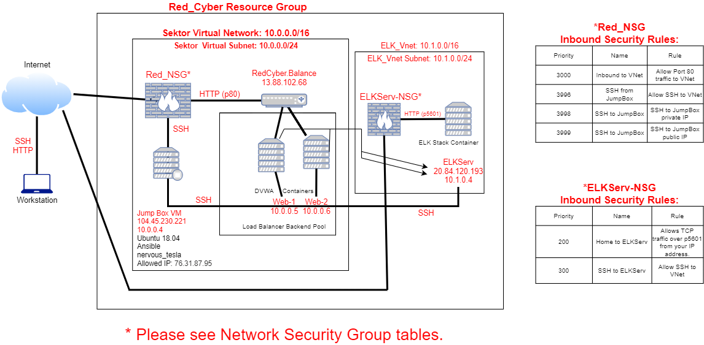
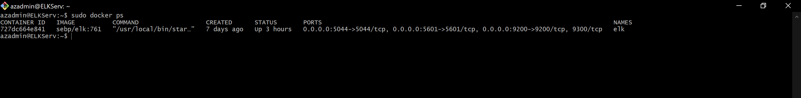

# Red-Cyber
A cloud monitoring system by configuring an ELK stack server.
## Automated ELK Stack Deployment

The files in this repository were used to configure the network depicted below.



These files have been tested and used to generate a live ELK deployment on Azure. They can be used to either recreate the entire deployment pictured above. Alternatively, select portions of the _`Ansible`_ file may be used to install only certain pieces of it, such as Filebeat.

  - [Ansible](/Ansible)

This document contains the following details:
- Description of the Topology
- Access Policies
- ELK Configuration
  - Beats in Use
  - Machines Being Monitored
- How to Use the Ansible Build


### Description of the Topology

The main purpose of this network is to expose a load-balanced and monitored instance of DVWA, the D*mn Vulnerable Web Application.

Load balancing ensures that the application will be highly _available_, in addition to restricting _traffic_ to the network.
- _What aspect of security do load balancers protect? A load balancer defends an organization against distributed denial-of-service (DDoS) attacks._ 
- _What is the advantage of a jump box? The advantage of a Jump Box is it focuses traffic through a single node. In turn, by securing and monitoring this single node, it is much easier than securing and monitoring each individual VM behind the gateway._

Integrating an ELK server allows users to easily monitor the vulnerable VMs for changes to the _machine_ and system _file_.
- _Filebeat helps generate and organize log files to send to Logstash and Elasticsearch. Specifically, it logs information about the file system, including which files have changed and when._
- _Metricbeat collects machine metrics, such as uptime._

The configuration details of each machine may be found below.

| Name     | Function | IP Address | Operating System |
|----------|----------|------------|------------------|
| Jump Box | Gateway  | 10.0.0.1   | Linux (Ubuntu 18.04)|
| Web-1    | Web Server| 10.0.0.5  | Linux (Ubuntu 18.04)|
| Web-2    | Web Server| 10.0.0.6  | Linux (Ubuntu 18.04)|
| ELKServ  | ELK Server| 10.1.0.4  | Linux (Ubuntu 18.04)|

### Access Policies

The machines on the internal network are not exposed to the public Internet. 

Only the _Jump Box and ELKServ_ machine can accept connections from the Internet. Access to these machines is only allowed from the following IP addresses:
- _76.31.87.95_

Machines within the network can only be accessed by _Jump Box VM_.
- _Jump Box VM: IP Address 10.0.0.4_

A summary of the access policies in place can be found in the table below.

| Name     | Publicly Accessible | Allowed IP Addresses |
|----------|---------------------|----------------------|
| Jump Box | Yes                 | 76.31.87.95          |
| Web-1    | No                  | 10.0.0.4             |
| Web-2    | No                  | 10.0.0.4             |
| ELKServ  | Yes                 | 10.0.0.4 76.31.87.95 |

### Elk Configuration

Ansible was used to automate configuration of the ELK machine. No configuration was performed manually, which is advantageous because...
- _Automating configuration with a provisioning tool like Ansible, will do exactly the same thing every time they run, eliminating as much variability between configurations as possible._

The playbook implements the following tasks:

- Set the `vm.max_map_count` to `262144`

- This configures the target VM (the machine being configured) to use more memory. The ELK container will not run without this setting.

	- You will want to use Ansible's `sysctl` module and configure it so that this setting is automatically run if your VM has been restarted.
		- The most common reason that the `ELK` container does not run, is caused by this setting being incorrect.
		- [Ansible sysctl](https://docs.ansible.com/ansible/latest/modules/sysctl_module.html)

-  Install the following `apt` packages:

	- `docker.io`: The Docker engine, used for running containers.
	- `python3-pip`: Package used to install Python software.

- Install the following `pip` packages:

  	- `docker`: Python client for Docker. Required by Ansbile to control the state of Docker containers.

- Downloads the Docker container called `sebp/elk:761`. `sebp` is the organization that made the container. `elk` is the container and `761` is the version.

- Configures the container to start with the following port mappings:
	- `5601:5601`
	- `9200:9200`
	- `5044:5044`

The following screenshot displays the result of running `docker ps` after successfully configuring the ELK instance.



### Target Machines & Beats
This ELK server is configured to monitor the following machines:
- _Web-1 Private IP address: 10.0.0.5_
- _Web-2 Pribate IP address: 10.0.0.6_

We have installed the following Beats on these machines:
- _Filebeat and Metricbeat_

These Beats allow us to collect the following information from each machine:
- _`Filebeat` collects data about the file system._
- _`Metricbeat` collects data about the machine metrics._

### Using the Playbook
In order to use the playbook, you will need to have an Ansible control node already configured. Assuming you have such a control node provisioned: 

SSH into the control node and follow the steps below:
- Copy the _`filebeat-config.yml`_ file to _your Web VMs at `/etc/filebeat/filebeat.yml`_.
- Update the _`hosts`_ file to include _the `[elk]` group. After updating the `hosts` file, create the new Ansible playbook to use for your new ELK virtual machine. The header of the Ansible playbook can specify which group of machines to run the playbook._
- Run the playbook, and navigate to _`http://[your.VM.IP]:5601/app/kibana`_ to check that the installation worked as expected.


### Commands
These are the commands to run for downloading the playbook, update the files, etc. 

  - command: `curl -L -O https://artifacts.elastic.co/downloads/beats/filebeat/filebeat-7.4.0-amd64.deb`

  - command: `sudo dpkg -i filebeat-7.4.0-amd64.deb`
---
Modify `/etc/filebeat/filebeat.yml` to set the connection information:
```
output.elasticsearch:
  hosts: ["<es_url>"]
  username: "elastic"
  password: "<password>"
setup.kibana:
  host: "<kibana_url>"
```
Where `<password>` is the password of the elastic user, `<es_url>` is the URL of Elasticsearch, and `<kibana_url>` is the URL of Kibana.

---
  - command: `sudo filebeat modules enable system`
	- Modify the settings in the /etc/filebeat/modules.d/system.yml file.

  - command: `sudo filebeat setup`
	- The `setup` command loads the Kibana dashboards. If the dashboards are already set up, omit this command.

  - command: `sudo service filebeat start`
---
Use the Ansible module `systemd` to make sure the filebeat service is running.
```
  - name: enable service filebeat on boot
    systemd:
      name: filebeat
      enabled: yes
```
### Thank You!
